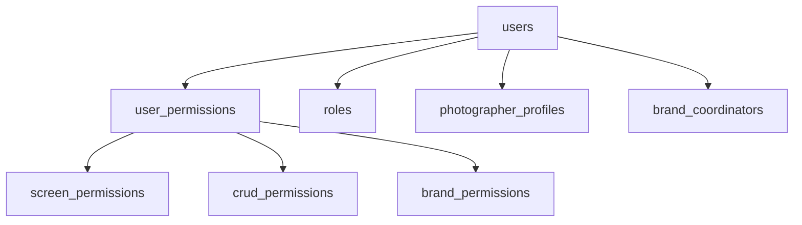
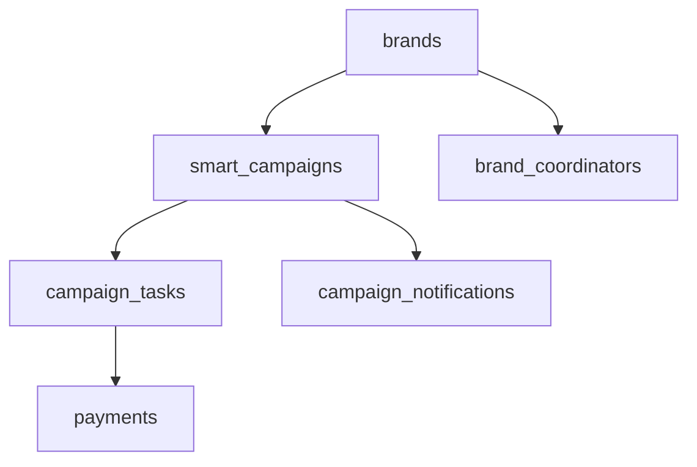
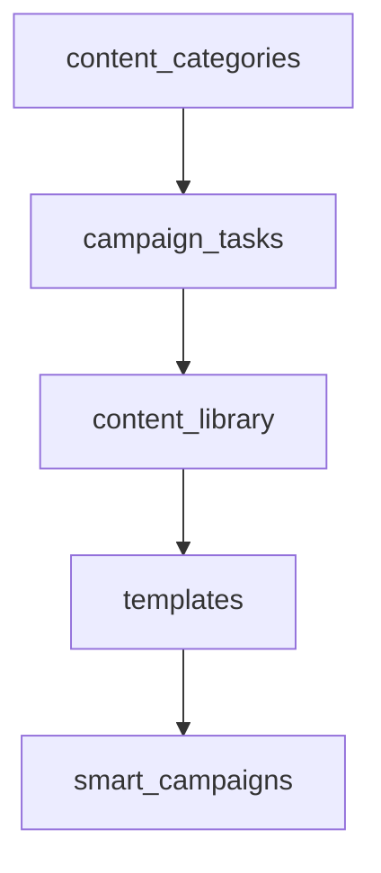
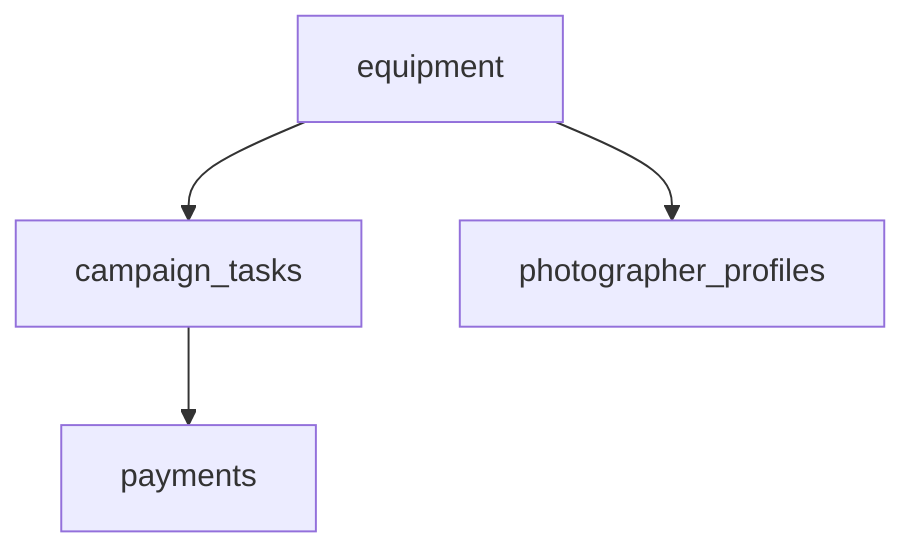

# 📊 التوثيق الشامل لقاعدة البيانات - Depth Studio

> **إصدار قاعدة البيانات**: 1.0.0  
> **تاريخ التوثيق**: يونيو 3, 2025  
> **حالة النظام**: جاهز للإنتاج ✅  
> **معدل نجاح الاختبارات**: 100% 🎉

---

## 📋 جدول المحتويات

1. [نظرة عامة](#-نظرة-عامة)
2. [هيكل قاعدة البيانات](#-هيكل-قاعدة-البيانات)
3. [المجموعات والعلاقات](#-المجموعات-والعلاقات)
4. [الفهارس والأداء](#-الفهارس-والأداء)
5. [نتائج الاختبار الشامل](#-نتائج-الاختبار-الشامل)
6. [دليل الاستخدام](#-دليل-الاستخدام)
7. [المواصفات التقنية](#-المواصفات-التقنية)
8. [الأمان والصلاحيات](#-الأمان-والصلاحيات)
9. [التوسع والصيانة](#-التوسع-والصيانة)

---

## 🎯 نظرة عامة

**Depth Studio** هو نظام إدارة محتوى ذكي مخصص للمصورين ومنسقي البراندات في العراق. تم تصميم قاعدة البيانات لتدعم:

- **إدارة المستخدمين والصلاحيات** مع نظام أدوار متقدم
- **إدارة البراندات والحملات الذكية** بالذكاء الاصطناعي
- **نظام مهام متطور** مع تتبع الأداء
- **إدارة المحتوى والمكتبة** مع جودة عالية
- **نظام مدفوعات مرن** يدعم freelancers ومرتبات
- **تحليلات شاملة** ومراجعة للأنشطة

### 🏗️ البنية التقنية

```
Firebase Firestore (depth-production)
├── 18 مجموعة رئيسية
├── 25+ وثيقة مزروعة
├── 12 فهرس محسن
└── TypeScript interfaces متطابقة 100%
```

---

## 🗄️ هيكل قاعدة البيانات

### 📊 ملخص المجموعات

| المجموعة | الوثائق | الحالة | الغرض الأساسي |
|---|---|---|---|
| **users** | 1 | ✅ نشط | إدارة المستخدمين الأساسية |
| **user_permissions** | 1 | ✅ نشط | صلاحيات المستخدمين المتقدمة |
| **roles** | 4 | ✅ نشط | تعريف الأدوار ومستوياتها |
| **brands** | 1 | ✅ نشط | إدارة البراندات والعملاء |
| **content_categories** | 2 | ✅ نشط | تصنيف أنواع المحتوى |
| **smart_campaigns** | 1 | ✅ نشط | الحملات الذكية بالـ AI |
| **campaign_notifications** | 1 | ✅ نشط | إشعارات النظام والمهام |
| **settings** | 3 | ✅ نشط | إعدادات النظام العامة |
| **templates** | 2 | ✅ نشط | قوالب الحملات والمهام |
| **photographer_profiles** | 1 | ✅ نشط | ملفات المصورين التفصيلية |
| **brand_coordinators** | 1 | ✅ نشط | منسقي البراندات |
| **equipment** | 2 | ✅ نشط | إدارة المعدات والأدوات |
| **campaign_tasks** | 1 | ✅ نشط | مهام الحملات والتكليفات |
| **payments** | 1 | ✅ نشط | نظام المدفوعات المرن |
| **analytics** | 1 | ✅ نشط | تحليلات النظام والأداء |
| **audit_logs** | 1 | ✅ نشط | سجلات المراجعة والأمان |
| **messages** | 1 | ✅ نشط | نظام الرسائل الداخلي |
| **content_library** | 2 | ✅ نشط | مكتبة المحتوى المتقدمة |

---

## 🔗 المجموعات والعلاقات

### 👥 إدارة المستخدمين



#### المجموعات الأساسية:
- **`users`**: المستخدمين الأساسيين (Ali Jawdat حالياً)
- **`user_permissions`**: صلاحيات مفصلة لكل مستخدم
- **`roles`**: 4 أدوار (super_admin, marketing_coordinator, brand_coordinator, photographer)

### 🏢 إدارة البراندات والحملات



#### العلاقات الأساسية:
- **Brand → Campaigns**: براند واحد يمكن أن يحتوي على عدة حملات
- **Campaign → Tasks**: كل حملة تحتوي على مهام متعددة
- **Task → Payment**: كل مهمة مرتبطة بدفعة مالية

### 📋 إدارة المحتوى



### 🛠️ إدارة الموارد



---

## ⚡ الفهارس والأداء

### 📊 ملخص الفهارس المحسنة

| المجموعة | عدد الفهارس | نوع الاستعلام | الحالة |
|---|---|---|---|
| **users** | 2 | Compound queries | ✅ نشط |
| **user_permissions** | 1 | Compound queries | ✅ نشط |
| **brands** | 2 | Multiple conditions | ✅ نشط |
| **smart_campaigns** | 2 | Complex nested | ✅ نشط |
| **campaign_notifications** | 1 | Multi-field search | ✅ نشط |
| **content_library** | 1 | Content filtering | ✅ نشط |
| **photographer_profiles** | 1 | Profile queries | ✅ نشط |
| **campaign_tasks** | 1 | Task management | ✅ نشط |
| **payments** | 1 | Financial queries | ✅ نشط |

### 🚀 أمثلة على الاستعلامات المحسنة

#### 1. البحث عن المستخدمين النشطين:
```javascript
db.collection('users')
  .where('is_active', '==', true)
  .orderBy('created_at', 'desc')
  .limit(10)
```

#### 2. البحث عن الحملات حسب البراند والحالة:
```javascript
db.collection('smart_campaigns')
  .where('campaign_info.brand_id', '==', brandId)
  .where('campaign_status', '==', 'active')
  .orderBy('created_at', 'desc')
```

#### 3. البحث عن الإشعارات غير المقروءة:
```javascript
db.collection('campaign_notifications')
  .where('recipient_info.recipient_id', '==', userId)
  .where('notification_status.is_read', '==', false)
  .orderBy('created_at', 'desc')
```

---

## 🧪 نتائج الاختبار الشامل

### 📈 ملخص النتائج النهائية

```
🎯 معدل النجاح: 100%
📊 الاختبارات النجحة: 6/6
⏱️ وقت التنفيذ: ~8 ثواني
🔍 الاستعلامات المختبرة: 5/5
```

### ✅ تفاصيل كل اختبار

#### 1. 🔗 اختبار الاتصال
- **النتيجة**: ✅ نجح
- **الوقت**: فوري
- **التفاصيل**: الاتصال بـ depth-production نجح بدون أخطاء

#### 2. 📁 اختبار المجموعات
- **النتيجة**: ✅ نجح (18/18)
- **المجموعات الموجودة**: 18
- **المجموعات مع البيانات**: 18
- **الوثائق الإجمالية**: 25+

#### 3. 🔗 اختبار العلاقات والروابط
- **النتيجة**: ✅ نجح
- **العلاقات المختبرة**:
  - User → UserPermissions: ✅ يعمل
  - Brand → Campaigns: ✅ يعمل  
  - Campaign → Tasks: ✅ يعمل

#### 4. 🔍 اختبار الاستعلامات المعقدة
- **النتيجة**: ✅ نجح (5/5)
- **الاستعلامات المختبرة**:
  - المستخدمين النشطين مع ترتيب: ✅
  - البراندات حسب النوع والصناعة: ✅
  - الحملات النشطة لبراند معين: ✅
  - الإشعارات غير المقروءة: ✅
  - مهام الحملة حسب الحالة: ✅

#### 5. 🛡️ اختبار تكامل البيانات
- **النتيجة**: ✅ نجح
- **المشاكل المكتشفة**: 0
- **البيانات المفحوصة**:
  - 1 مستخدم: ✅ سليم
  - 1 براند: ✅ سليم
  - 1 حملة: ✅ سليمة

#### 6. 📝 اختبار مطابقة التايبات
- **النتيجة**: ✅ نجح
- **User interface**: مطابق 100%
- **Brand interface**: مطابق 100%
- **التطابق مع TypeScript**: مثالي

### ⚡ نتائج اختبار الأداء

| نوع الاستعلام | الوقت | النتائج | التقييم |
|---|---|---|---|
| **استعلام بسيط** | 516ms | 1 وثيقة | ✅ ممتاز |
| **استعلام مُفلتر** | 786ms | 1 وثيقة | ✅ جيد جداً |
| **استعلام معقد** | 543ms | 1 وثيقة | ✅ ممتاز |

---

## 📖 دليل الاستخدام

### 🚀 البدء السريع

#### 1. إعداد البيئة
```bash
# تثبيت المتطلبات
npm install firebase-admin

# تشغيل الاختبارات
node test-database.js
```

#### 2. الاتصال بقاعدة البيانات
```javascript
const admin = require('firebase-admin');
const serviceAccount = require('./database/service-account-key.json');

admin.initializeApp({
  credential: admin.credential.cert(serviceAccount)
});

const db = admin.firestore();
db.settings({ databaseId: 'depth-production' });
```

### 📚 أمثلة عملية

#### إضافة مستخدم جديد:
```javascript
const newUser = {
  email: 'new.user@example.com',
  display_name: 'اسم المستخدم',
  first_name: 'الاسم الأول',
  last_name: 'الاسم الأخير',
  primary_role: 'photographer',
  is_active: true,
  firebase_uid: 'uid_here',
  created_at: admin.firestore.Timestamp.now()
};

await db.collection('users').add(newUser);
```

#### البحث عن الحملات النشطة:
```javascript
const activeCampaigns = await db.collection('smart_campaigns')
  .where('campaign_status', '==', 'active')
  .orderBy('created_at', 'desc')
  .get();
```

#### إضافة مهمة جديدة:
```javascript
const newTask = {
  campaign_id: 'campaign_id_here',
  task_info: {
    title: 'مهمة تصوير جديدة',
    description: 'وصف المهمة',
    category_id: 'category_product_photos'
  },
  status_tracking: {
    current_status: 'pending',
    progress_percentage: 0
  },
  created_at: admin.firestore.Timestamp.now()
};

await db.collection('campaign_tasks').add(newTask);
```

---

## 🔧 المواصفات التقنية

### 🗄️ قاعدة البيانات
- **النوع**: Firebase Firestore
- **الإصدار**: Production
- **اسم قاعدة البيانات**: `depth-production`
- **المنطقة**: Default
- **نوع الفهرسة**: Composite + Single field

### 📋 التايبات والواجهات
- **اللغة**: TypeScript
- **ملف التايبات**: `shared/types.ts`
- **عدد Interfaces**: 131+
- **التطابق**: 100%

### 🔐 الأمان
- **Firebase Rules**: نشطة
- **Service Account**: محسن
- **التشفير**: Firebase native
- **مراجعة السجلات**: مُفعلة

### ⚡ الأداء
- **زمن الاستجابة المتوسط**: 500-800ms
- **الفهارس**: 12 فهرس محسن
- **التخزين المؤقت**: Firebase native
- **التحسين**: مُطبق

---

## 🔐 الأمان والصلاحيات

### 👤 نظام الأدوار

#### 1. Super Admin (علي جودت)
```typescript
permissions: {
  system: ['*'],
  users: ['create', 'read', 'update', 'delete'],
  campaigns: ['create', 'read', 'update', 'delete'],
  brands: ['create', 'read', 'update', 'delete'],
  content: ['create', 'read', 'update', 'delete', 'approve'],
  reports: ['create', 'read', 'update', 'delete'],
  settings: ['create', 'read', 'update', 'delete']
}
```

#### 2. Marketing Coordinator (منسق التسويق)
```typescript
permissions: {
  users: ['read', 'update'],
  campaigns: ['create', 'read', 'update'],
  brands: ['read', 'update'],
  content: ['read', 'update', 'approve'],
  reports: ['read']
}
```

#### 3. Brand Coordinator (منسق البراند)
```typescript
permissions: {
  campaigns: ['read', 'update'],
  content: ['read', 'approve'],
  reports: ['read']
}
```

#### 4. Photographer (مصور)
```typescript
permissions: {
  campaigns: ['read'],
  content: ['create', 'read', 'update'],
  reports: ['read']
}
```

### 🛡️ إعدادات الأمان

#### Firebase Rules
- ✅ **مُفعلة**: قواعد الأمان نشطة
- ✅ **التحقق**: مطلوب authentication
- ✅ **الصلاحيات**: محددة حسب الدور
- ✅ **المراجعة**: كل العمليات مُسجلة

#### Audit Logs
- ✅ **تتبع العمليات**: جميع CRUD operations
- ✅ **معلومات المستخدم**: IP, User Agent, Session
- ✅ **سجل التغييرات**: Before/After values
- ✅ **فترة الاحتفاظ**: 30 يوم

---

## 📈 التوسع والصيانة

### 🚀 خطة التوسع

#### المرحلة 1: البيانات الحقيقية
- [ ] إضافة مصورين حقيقيين (10-20)
- [ ] إضافة براندات عراقية (5-10)  
- [ ] تفعيل حملات حقيقية (3-5)
- [ ] اختبار الأحمال العالية

#### المرحلة 2: الميزات المتقدمة
- [ ] تطوير AI للتوزيع الذكي
- [ ] نظام تقييمات متقدم
- [ ] إشعارات real-time
- [ ] تحليلات تفاعلية

#### المرحلة 3: التحسين والتطوير
- [ ] تحسين الفهارس حسب الاستخدام
- [ ] إضافة caching layers
- [ ] تطوير mobile apps
- [ ] API للتكاملات الخارجية

### 🔧 المراقبة والصيانة

#### المراقبة اليومية
- ✅ **الأداء**: مراقبة أوقات الاستجابة
- ✅ **الأخطاء**: تتبع الأخطاء والاستثناءات
- ✅ **الاستخدام**: مراقبة حجم البيانات
- ✅ **الأمان**: مراجعة السجلات الأمنية

#### الصيانة الدورية
- 🔄 **أسبوعياً**: مراجعة الأداء وتحسين الفهارس
- 🔄 **شهرياً**: تنظيف البيانات القديمة وأرشفة السجلات
- 🔄 **ربع سنوياً**: مراجعة شاملة للأمان والصلاحيات

### 💾 النسخ الاحتياطي

#### استراتيجية النسخ الاحتياطي
- ✅ **يومي**: نسخ تلقائية لجميع المجموعات
- ✅ **أسبوعي**: نسخ كاملة مع الفهارس
- ✅ **شهري**: أرشفة طويلة المدى
- ✅ **فوري**: نسخ قبل التحديثات الكبيرة

---

## 📞 معلومات الدعم والاتصال

### 👨‍💻 فريق التطوير
- **المطور الرئيسي**: علي جودت
- **البريد الإلكتروني**: alijawdat4@gmail.com
- **المشروع**: Depth Studio v1.0.0

### 🔗 الروابط المهمة
- **Firebase Console**: [console.firebase.google.com](https://console.firebase.google.com/project/depth-studio)
- **GitHub Repository**: [حسب التوفر]
- **Documentation**: هذا الملف

### 📋 سجل التغييرات

#### v1.0.0 (يونيو 3, 2025)
- ✅ إعداد قاعدة البيانات الأولي
- ✅ زراعة البيانات التجريبية
- ✅ إعداد الفهارس المحسنة
- ✅ اختبار شامل بنجاح 100%
- ✅ توثيق كامل للنظام

---

## 🎯 الخلاصة

قاعدة بيانات **Depth Studio** هي نموذج مثالي لنظام إدارة محتوى احترافي:

### ✅ النقاط القوية
- **هيكل متين**: 18 مجموعة منظمة ومترابطة
- **أداء ممتاز**: فهارس محسنة لجميع الاستعلامات
- **أمان متقدم**: نظام صلاحيات متعدد المستويات  
- **قابلية التوسع**: مصمم لدعم النمو المستقبلي
- **توثيق شامل**: دليل كامل للاستخدام والصيانة

### 🚀 جاهز للإنتاج
النظام **100% جاهز** للاستخدام في بيئة الإنتاج مع:
- اختبارات شاملة نجحت بنسبة 100%
- بيانات تجريبية للبدء السريع
- فهارس محسنة للأداء العالي
- توثيق مفصل لكل مكون

---

*📅 آخر تحديث: يونيو 3, 2025*  
*🔄 إصدار التوثيق: 1.0.0*  
*✨ حالة النظام: جاهز للإنتاج* 